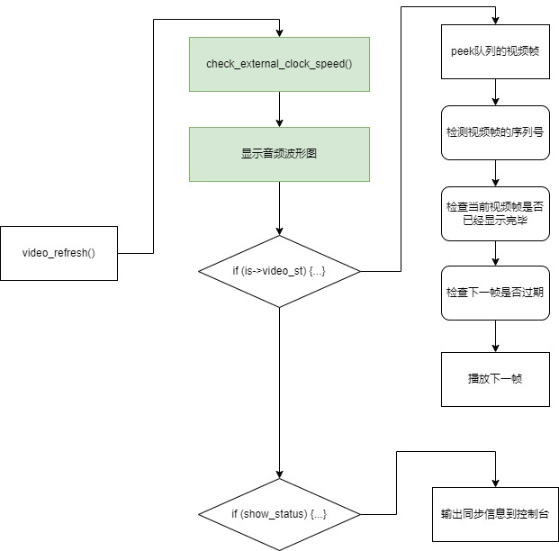

# 源码解析

## 主要模块

* libavcodec : 编/解码
* libavdevice : 设备视频文件的封装/解封装
* libavfilter : 帧级操作（如添加滤镜）
* libavformat : 文件 I/O 和 **封装/解封装**
* libavutil : 通用工具集合
* libpostproc : 预处理
* libswresample : 音频重采样、格式处理、混音等
* libswscale : 色彩处理和缩放

## video_refresh函数流程  绿色部分默认不执行   


## 有趣的命名
注意`FrameQueue`队列相关函数用的动词是`peek`，而`PakcetQueue`队列相关函数用的动词是`get`。

这两种不同的命名其实也是有意为之的。编程经验丰富的程序员基本都会知道，peek 代表偷看，只是看一下队列的数据，大部分情况并不会把队列的数据销毁。

在 FFplay 播放器里面，peek 也是代表偷看的意思，如果你一直调 frame_queue_peek_next() 读取到的都是同一帧，如果想读到下一帧，就需要手动调 frame_queue_next() 偏移一下，如下：
```c
while(;;){
    Frame* f = frame_queue_peek_next();
    //frame_queue_next();
}
```
而对于 PacketQueue 队列来说，他是 get 操作，可以一直读到下一帧。
```c
while(;;){
    MyAVPacketList*  = packet_queue_get();
}
```
所以 对于`FrameQueue`队列， peek + next 是分开操作的。而对于`PacketQueue`队列，peek + next 合成了一步 get 。  
数据结构为什么如此设计呢？  

是因为，`PacketQueue`队列是给`解码器`用的，从队列拿一个帧，必然需要立即丢给解码器。  
而`FrameQueue`队列 是给`SDL 播放`用的，从队列 peek 一个帧，不一定就需要播放，如果还没到播放时间，就不需要播放。