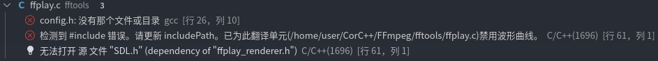

# 编译遇到的问题

## VsCode调试时遇到include问题
只要c_cpp_properties.json包含了以下项目
```json
"includePath": ["${workspaceFolder}/**"],
```
这里的`${workspaceFolder}/**`表示本工作目录下所有文件

* 所以include问题应该是依赖导致  
* 一般是因为本机器`缺失了`或`无法找到`某些库文件
* 比如我遇到的
    
* 解决方法include库文件
    ```
    "includePath": [
        "${workspaceFolder}/**",
        "/usr/include/**"
    ],
    ```

## 编译命令
```bash
./configure --prefix=/usr/local/ffmpeg
make -j 8
sudo make install
```

## 编译出来没有ffplay
原因是没有安装sdl2库  
```bash
sudo apt install libsdl2-dev
```


